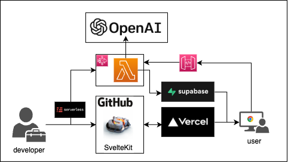

# OpinionAI

<div></div>

<div align="center">This system is an opinion generator that employs SvelteKit for the frontend, OpenAI's API for the backend, and AWS StepFunctions and Supabase for the infrastructure.</div>

- [OpinionAI](#opinionai)
- [Installation](#installation)
- [Usage](#usage)
- [Architecture](#architecture)

# Installation

```bash
$ git clone https://github.com/maaaashi/opinion-ai.git
$ cd opinion-ai
$ pnpm install
```

# Usage

```bash
$ pnpm run dev
```

Access to http://localhost:3000

# Architecture

<div></div>
